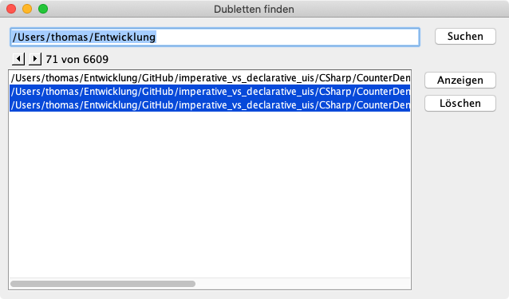

# Welcome

TKDupeFinder is a small tool to find duplicate files. Just enter the base directory and the app will search for files with the same [MD5](https://en.wikipedia.org/wiki/MD5) hash. These are considered the same. You can select versions, display and delete them. The app is more than ten years old, so the source code may not be what you would expect today. Still, Pull requests are welcome. :-) It aged in a private repo, but recently I thought it might be useful for others, so I decided to make it available.

There are no big plans for this; I should probably convert it to a Java module and provide runtime images.

You can find executable *.jar* files [here](https://github.com/tkuenneth/TKDupeFinder/tree/main/target).