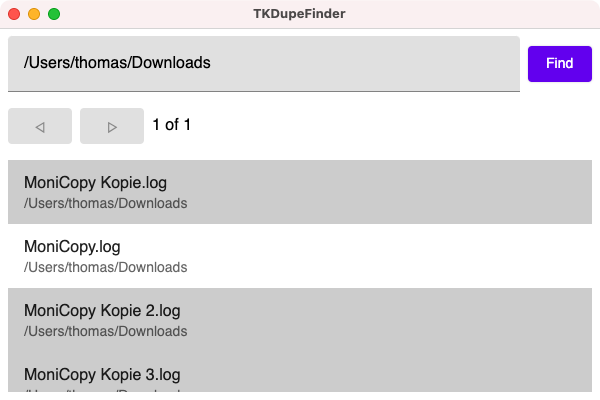

## Welcome to TKDupeFinder
### A small tool to find duplicate files

Just enter the base directory and the app will search for files with the same [MD5](https://en.wikipedia.org/wiki/MD5) hash. These are considered the same. You can select versions, display and delete them. 

The original app is more than ten years old. It aged in a private repo, but one day I thought it might be useful for others. So I made it available to the public. The new user interface is using [Compose for Desktop](https://github.com/JetBrains/compose-jb). But the old Swing version is still there and functioning, too.